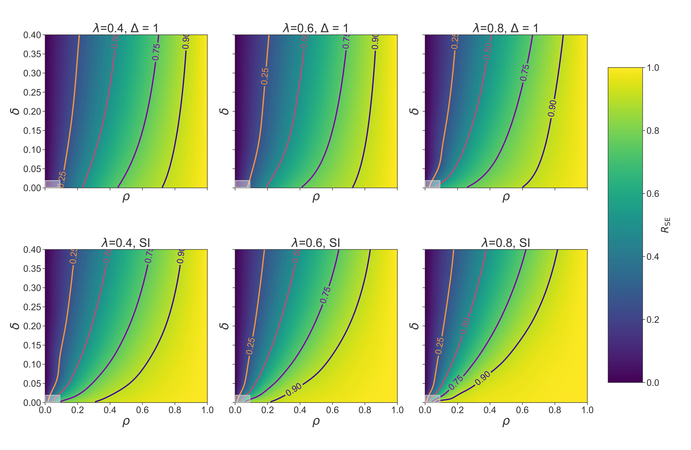

# Results of Belief Propagation for Epidemic Inference \[BPEpI\]
Repository contanings the notebooks and codes to reproduce the results presented in the paper:
"Bayes-optimal inference for spreading processes on random networks"

  

## BPEpI
To be able to reproduce the simulations, it is required to install the BPEpI package (see the [BPEpI](https://github.com/ocadni/bpepi) repo)
For an example of how to use the code, see the introductory notebook *demo.ipynb*.

### Analysys
Inside the folder *Analysys* we put the Python code necessary to reproduce our simulations

### Figures
The folder *Figures* contains all the Jupyter notebooks necessary to reproduce the Figures in the paper, given the data

### Data
The folder *Data* contains all the data frames, compressed in .xz format, which are needed to run the notebooks in the folder Figures

### Plots 
The folder *Plots* contains all the plots of the paper, obtained directly from the notebooks present in the folder Figures.
